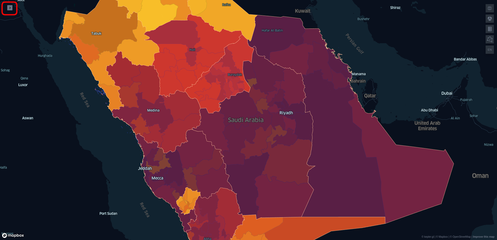
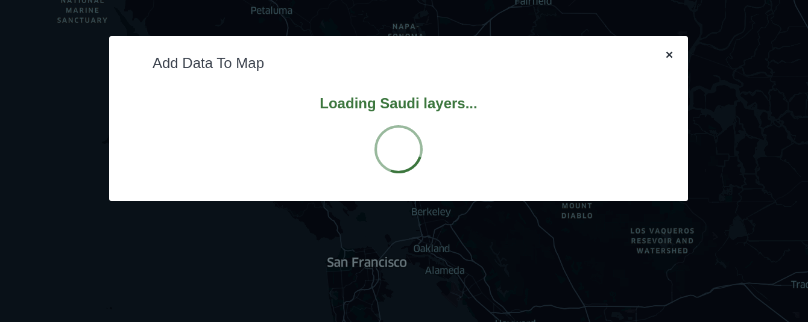
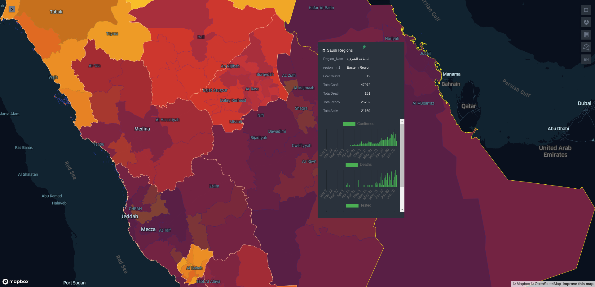

# Building a Map app with Kepler.gl

## :material-chevron-right-circle: Additional tweaks and customizations to the map app
In this section, we will explore some tweaks that can be done in our app after integrating it with kepler.gl successfully.

### **1. Render Custom UI components**
- Before diving in the those tweaks, we need to know about a powerful thing that has been developed by the folks of kepler.gl.

**:material-comment-quote: Quoting from [Kepler's :material-github: github repository](https://github.com/keplergl/kepler.gl)**: 

:material-chevron-double-right: To have the flexibility to render custom kepler.gl components. Kepler.gl has a dependency injection system that allow you to inject components to KeplerGl to replace existing ones. All you need to do is to create a component factory for the one you want to replace, import the original component factory and call `injectComponents` at the root component of your app where KeplerGl is mounted.

**:material-layers-triple: For example:**

To render a custom side panel header in kepler.gl, you can implement the following.

```javascript
import {injectComponents, PanelHeaderFactory} from 'kepler.gl/components';

// define custom header
const CustomHeader = () => <div>My kepler.gl app</div>;
const myCustomHeaderFactory = () => CustomHeader;

// Inject custom header into Kepler.gl, replacing default
const KeplerGl = injectComponents([
    [PanelHeaderFactory, myCustomHeaderFactory]
]);

// render KeplerGl, it will render your custom header instead of the default
const MapContainer = () => (
    <div>
        <KeplerGl id="foo" ...otherProps />
    </div>
);
```

- So it's pretty much simple:
    - You find the component you want to customize from [kepler's source code](https://github.com/keplergl/kepler.gl/tree/master/src).
    - Create your customized component and create a factory that displays that component.
    - Inject the factory of your customized component with the factory of the comonent that you want to replace.
    - Create and use the customized `KeplerGl` component instead of importing the default one.

- Read more about [replacing UI component](https://github.com/keplergl/kepler.gl/blob/master/docs/api-reference/advanced-usages/replace-ui-component.md).

- Now, we will go through some examples of customizing the UI of our app.

### **2. Disable Adding data**
- If you want to remove the `Add data` button that appears at the side panel (You want the users to not change your data).
```javascript
// import KeplerGl from "kepler.gl"
import { injectComponents, AddDataButtonFactory } from "kepler.gl/components"

const CustomDataBtn = () => (<></>)
const customDataBtnFactory = () => CustomDataBtn;

const KeplerGl = injectComponents([
    [AddDataButtonFactory, customDataBtnFactory]
])
```
- The `Add data` button is removed easily.


!!! warning
    Don't forget to remove the default import of `KeplerGl` object in order to use the customized one.

### **3. Collapse side panel**
- If you want the side panel to be collapsed when you open the app by default. You will need to use a customized version of `keplerGlReducer` to [initialize a uiState](https://docs.kepler.gl/docs/api-reference/reducers/ui-state#initial_ui_state).

```javascript hl_lines="4 9"
const customKeplerGlReducer = keplerGlReducer.initialState({
    uiState: {
        // Hide side panel when mounted
        activeSidePanel: null
    }
})

const reducers = combineReducers({
    keplerGl: customKeplerGlReducer // instead of keplerGl: keplerGlReducer
})
```



### **4. Loading Spinner until the map is ready**

!!! warning
    This tweak has a bug in its concept as it will be explained later in this section.

- You may notice that the app takes sometime fetching and displaying the data on the map and there's nothing indicating that. We can add a loader spinner to be running untill the map is ready.

- We need to add a flag to indicate if the map is updated and ready.

```javascript hl_lines="1 30"
const [mapUpdated, setMapUpdated] = useState(false)

useEffect(() => {
    if (regionsData && governatesData){
        dispatch(
            addDataToMap({
                datasets: [
                    {
                        info: {
                            label: 'Saudi Regions',
                            id: 'covidRegions'
                        },
                        data: regionsData
                    },
                    {
                        info: {
                            label: 'Saudi Governates',
                            id: 'covidGovernates'
                        },
                        data: governatesData
                    }
                ],
                option: {
                    centerMap: true
                },
                config: mapConfig
            })
        )
        dispatch(setExportData(false))
        setMapUpdated(true)
    }
}, [dispatch, regionsData, governatesData])

// In the return of the Map component
return (
    mapUpdated ? 
        <KeplerGl
            id="myId"
            mapboxApiAccessToken={process.env.REACT_APP_MAPBOX_API}
            width={window.innerWidth}
            height={window.innerHeight}
            appName="Kepler | My App"
        /> 
    : <></>
)
```

!!! bug
    For no reason, when doing this simple check, it makes the `Add Data to Map` modal appears for sometime until the map is ready, then it disappears showing the normal map.

    So the idea behind this tweak is to replace the factory that is responsible for showing `Add Data to Map` modal with a loading spinner.

- We will use a package called [react-loader-spinner](https://www.npmjs.com/package/react-loader-spinner) that provides simple React SVG spinner component. Add the package to the project by running:
```shell
npm i react-loader-spinner
```

- If we dig inside [kepler's source code](https://github.com/keplergl/kepler.gl/tree/master/src), we should find the [factory responsible of loading the data](https://github.com/keplergl/kepler.gl/blob/master/src/components/modals/load-data-modal.js) which is called `LoadDataModalFactory`. 

- In your app `src` directory, create a directory with the name `components` to hold our custom components, navigate inside it and create a javascript file called `CustomLoadDataModal.js`. Inside it add the following implementation:
```javascript
// In CustomLoadDataModal.js component
import React from 'react';
import styled from 'styled-components';
import Loader from "react-loader-spinner";

const StyledLoadingDialog = styled.div`
    display: flex;
    align-items: center;
    justify-content: center;
    flex-grow: 1;
    flex-direction: column;

    h1 {
        display: block;
        color: #3C763D;
    }
`;

const CustomLoadDataModal = () => (
    <StyledLoadingDialog>
        <h1>Loading Saudi layers...</h1>
        <Loader type="Oval" color="#3C763D" height={80} width={80} />
    </StyledLoadingDialog>
);

export default CustomLoadDataModal;
```

- Inside your app `src` directory also, create a directory with the name `factories` to hold our custom components factories, navigate inside it and create a javascript file called `load-data-modal.js`. Inside it add the following implementation:
```javascript
// In load-data-modal.js factory
import CustomLoadDataModal from "../components/CustomLoadDataModal"
import { LoadDataModalFactory } from "kepler.gl/components"

const customLoadDataModalFactory = () => CustomLoadDataModal;

export function replaceLoadDataModal() {
    return [LoadDataModalFactory, customLoadDataModalFactory];
}
```

- Now our custom component and factory is ready to be imported in `App.js` file. So in `App.js` add the following:
```javascript
import { replaceLoadDataModal } from "./factories/load-data-modal"

const KeplerGl = injectComponents([
    replaceLoadDataModal()
])
```

- You should find the loading spinner working smoothly.




### **5. Display statistical graphs in the map popover**
- In this tweak, we will try to display some statistical graphs represents the daily recording of the COVID-19 confirmed, deaths, and tested cases in each Saudi region. This graphs should appear under the identify info.

- Let's first identify which factory we will be using. If we dig inside [kepler's source code](https://github.com/keplergl/kepler.gl/tree/master/src), we should find the [factory responsible of displaying layer popup info](https://github.com/keplergl/kepler.gl/blob/master/src/components/map/layer-hover-info.js) which is called `LayerHoverInfoFactory`.


#### **A. Create the custom component and its factory**

- Navigate to the directory `src/components`, create a directory called `LayerHoverInfo` and inside it, create a javascript file called `CustomLayerHoverInfo.js`. Inside it add the following implementation:
```javascript hl_lines="147"
import React from 'react';
import styled from 'styled-components';
import {CenterFlexbox} from "kepler.gl/dist/components/common/styled-components";
import {Layers} from "kepler.gl/dist/components/common/icons";
import PropTypes from 'prop-types';
import { parseFieldValue } from "kepler.gl/dist/utils/data-utils";

export const StyledLayerName = styled(CenterFlexbox)`
    color: ${(props) => props.theme.textColorHl};
    font-size: 12px;
    letter-spacing: 0.43px;
    text-transform: capitalize;
    padding: 0 14px;
    margin-top: 12px;
    svg {
        margin-right: 4px;
    }
`;

const Row = ({ name, value, url }) => {
    // Set 'url' to 'value' if it looks like a url
    if (!url && value && typeof value === "string" && value.match(/^http/)) {
        url = value;
    }

    const asImg = //.test(name);
    return (
        <tr className="row" key={name}>
        <td className="row__name">{name}</td>
        <td className="row__value">
            {asImg ? (
            
            ) : url ? (
            <a target="_blank" rel="noopener noreferrer" href={url}>
                {value}
            </a>
            ) : (
            value
            )}
        </td>
        </tr>
    );
};

const EntryInfo = ({ fieldsToShow, fields, data }) => (
    <tbody>
        {fieldsToShow.map((name) => (
        <EntryInfoRow key={name} name={name} fields={fields} data={data} />
        ))}
    </tbody>
);

const EntryInfoRow = ({ name, fields, data }) => {
    const field = fields.find((f) => f.name === name);
    if (!field) {
        return null;
    }

    const valueIdx = field.tableFieldIndex - 1;
    const displayValue = parseFieldValue(data[valueIdx], field.type);

    return <Row name={name} value={displayValue} />;
};

const CellInfo = ({ data, layer }) => {
    const { colorField, sizeField } = layer.config;

    return (
        <tbody>
        <Row
            name={"total points"}
            key="count"
            value={data.points && data.points.length}
        />
        {colorField && layer.visualChannels.color ? (
            <Row
            name={layer.getVisualChannelDescription("color").measure}
            key="color"
            value={data.colorValue || "N/A"}
            />
        ) : null}
        {sizeField && layer.visualChannels.size ? (
            <Row
            name={layer.getVisualChannelDescription("size").measure}
            key="size"
            value={data.elevationValue || "N/A"}
            />
        ) : null}
        </tbody>
    );
};


const CustomLayerHoverInfo = (props) => {
    const CustomLayerHoverInfo = (props) => {
        const { data, layer } = props;

        if (!data || !layer) {
            return null;
        }

        return (
            <div className="map-popover__layer-info">
            <StyledLayerName className="map-popover__layer-name">
                <Layers height="12px" />
                {props.layer.config.label}
            </StyledLayerName>
            <table className="map-popover__table">
                {props.layer.isAggregated ? (
                <CellInfo {...props} />
                ) : (
                <EntryInfo {...props} />
                )}
            </table>
            <span>Graphs to be here</span>
            </div>
        );
    };
};


CustomLayerHoverInfo.propTypes = {
    fields: PropTypes.arrayOf(PropTypes.any),
    fieldsToShow: PropTypes.arrayOf(PropTypes.any),
    layer: PropTypes.object,
    data: PropTypes.oneOfType([
        PropTypes.arrayOf(PropTypes.any),
        PropTypes.object,
    ]),
};

export default CustomLayerHoverInfo;
```
!!! note
    If you explore the above code, you will find it the same as [layer-hover-info component](https://github.com/keplergl/kepler.gl/blob/master/src/components/map/layer-hover-info.js) of kepler.gl except for the highlighted line at which we will add our Charts.
    This line will be removed for sure, it's just for testing the ability to add elements to the popover.

- Now, we have created our custom component, but it needs a props to be passed into it, so we will create an auxiliary component that is responsible for getting the props from the original `LayerHoverInfoFactory` and and passing it to our component.

- In the same directory of `src/components/LayerHoverInfo`, create a javascript file called `AuxLayerHoverInfo.js`. Inside it add the following implementation:
```javascript
import React from 'react';
import CustomLayerHoverInfo from "./CustomLayerHoverInfo"

const AuxLayerHoverInfo = (props) => <CustomLayerHoverInfo {...props} />

export default AuxLayerHoverInfo
```

- Now it's the time for creating our factory, navigate to `src/factories/`, create a factory called `layer-hover-info.js`. Inside it add the following implementation:
```javascript
import AuxLayerHoverInfo from "../components/LayerHoverInfo/AuxLayerHoverInfo"
import {LayerHoverInfoFactory} from "kepler.gl/components"

const CustomLayerHoverInfoFactory = () => AuxLayerHoverInfo

export function replaceLayerHoverInfo() {
    return [LayerHoverInfoFactory, CustomLayerHoverInfoFactory]
}
```

- Then import our factory into `App.js` file and inject it to replace the `LayerHoverInfoFactory` with ours.
```javascript
import { replaceLayerHoverInfo } from "./factories/layer-hover-info"

const KeplerGl = injectComponents([
    replaceLayerHoverInfo()
])
```

- Navigate to `http://localhost:3000/`, you should find in the popover the paragraph we have added in `CustomLayerHoverInfo.js` which is **Graphs to be here**.

#### **B. Create the chart component**
- To draw the charts, we will use a popular javascript library called [chart.js](https://www.npmjs.com/package/chart.js) alongside a library called [d3](https://www.npmjs.com/package/d3). Add them to the project by running:
```shell
npm i chart.js d3
```
##### **B.1 Create a BarChartViewer component**

In this component, we shall fetch the data and import a **BarChart** component for each COVID-19 case.

- Navigate to `src/components/`, create a directory called `BarChartViewer` and inside it create a javascript file called `BarChartViewer.js`.

- In order to get the daily recording of cases, we will use a third layer called [Covid-19 Cases Hosted View In Saudi Arabia
](http://datagovsa.mapapps.cloud/layers/geonode_data:geonode:hostedview) as a GeoJSON format. This data holds a timeline day-by-day recording of COVID-19 cases for each Saudi region.

!!! note
    As usual, navigate to the layer URL, and click on `Download Layer` button, right-click on `GeoJSON` format and copy link address.

- Fetch the data using axios.
```javascript
import React, { Component } from "react";
import axois from "axios";
import Loader from "react-loader-spinner";

class BarChartViewer extends Component {
    constructor(props) {
        super(props);

        this.state = {
        saudiData: [],
        loading: true,
        };
    }

    componentDidMount() {
        axois.get("http://datagovsa.mapapps.cloud/geoserver/ows?srsName=EPSG%3A3857&outputFormat=json&service=WFS&srs=EPSG%3A3857&request=GetFeature&typename=geonode%3Ahostedview&version=1.0.0")
        .then((response) => {
            this.setState({
                saudiData: response.data.features,
                loading: false,
            });
        });
    }

    render() {
        const { saudiData, loading } = this.state;
        return (
            <div>
                {!loading ? (
                <div>
                    <span>Confirmed, deaths, and tested BarCharts here</span>
                </div>
                ) : (
                    <Loader type="Oval" color="#4BAE53" height={50} width={50} />
                )}
            </div>
        );
    }
}

export default BarChartViewer;
```
!!! note
    We have used the `Loader spinner` to appear untill the graphs are fully loaded.


##### **B.2 Create a BarChart component**
In this component we shall recieve the data, do some processing on it, prepare the charts and display them.

- Keep in mind that for this component, we should recieve three props:
    * `data`: The data that contains all the cases.
    * `regionName`: The specific region which its data should be fetched.
    * `caseType`: The type of the case that should be drawn (e.g. Confirmed, Deaths...).

- Navigate to `src/components/BarChartViewer`, create a directory called `BarChart` and inside it create a javascript file called `BarChart.js`.

**BarChart Initialization**

- We’ll need to reference the Canvas element when the chart is created so add a React ref to the component:
```javascript
import React, { Component, createRef } from "react";

class BarChart extends Component {
    constructor(props) {
        super(props);
        this.chartRef = createRef();
    }

    render() {
        return <canvas ref={this.chartRef} />;
    }
}
```

- Create a function called `prepareChart` which instantiates a Chart.js bar chart. 

```javascript
import Chart from "chart.js";

prepareChart = () => {
    const graphData = this.preprocessData(this.props.regionName);

    this.customChart = new Chart(this.chartRef.current, {
        type: "bar",
        data: {
            labels: graphData.dates,
            datasets: [
                {
                    label: this.props.caseType,
                    data: graphData.totalCases,
                    backgroundColor: "#4BAE53",
                },
            ],
        },
        options: {
            scales: {
            xAxes: [
                {
                type: "time",
                time: {
                    unit: "day",
                },
                },
            ],
            yAxes: [
                {
                ticks: {
                    min: 0,
                },
                display: false,
                },
            ],
            },
        },
    });
};
```

!!! note
    - The `preprocessData` function will recieve the **regionName** prop and return something like this:
        * `dates`: Array of ascending-sorted dates.
        * `totalCases`: Array of cases as each case corresponding to each date index.

- Create a function called `preprocessData` that should do the following:
    1. Filter the data by regionName.
    2. Sort the filtered-by-region data according to their dates in ascending order.
    3. Format the dates to be **yyyy-mm-dd** instead of the current, yyyy-mm-dd:hh-mm-ss.
    4. Create total cases in each region for each day and return the output in the format `{'dates', 'totalCases'}`.

```javascript
preprocessData = (regionName) => {
    let regionValues = [];
    // 1. Filter data by region
    regionValues = this.props.data.filter(
        (d) => d.properties.RegionNa_1 === regionName
    );

    // 2. Sort filtered-by-region data
    regionValues = regionValues
    .slice()
    .sort((a, b) =>
        d3.ascending(a.properties.Reportdt, b.properties.Reportdt)
    );

    // 3. Format the date to be yyyy-mm-dd instead of the current
    const labelDates = regionValues.map((d) =>
        d.properties.Reportdt.slice(0, 10)
    );
    regionValues.map((d, i) => (d.properties.Reportdt = labelDates[i]));

    // 4. Create total cases for each day. The output should be something like this:
    // dates: Array of dates, totalCases: Array of cases as each case corresponding to each date index.
    let totalDatesCases = {
        dates: this.removeDuplicateDates(labelDates),
        totalCases: this.generateValidCases(regionValues, this.props.caseType),
    };
    return totalDatesCases;
};
```

- The function called `removeDuplicateDates` takes all the dates then splits them into two categories, one for non-duplicate dates and the other for the duplicates, take one instance of each dubplicate and return array of non-duplicate dates.

```javascript
removeDuplicateDates = (dates) => {
    let duplicateDates = [];
    let normalDates = [];

    for (let i = 0; i < dates.length - 1; i++) {
        if (dates[i + 1] === dates[i] && !duplicateDates.includes(dates[i])) {
            duplicateDates.push(dates[i]);
        } 
        else if (duplicateDates.includes(dates[i]) === false) {
            normalDates.push(dates[i]);
        }
    }

    return normalDates.concat(duplicateDates);
  };
```

- The function called `generateValidCases` takes two parameters, the data of specific region and the case type and returns array of values as it calculates the sum of set of records for one date.

```javascript
generateValidCases = (data, caseType) => {
    let validCases = [];
    let sumCasesforDate = 0;

    for (let i = 0; i < data.length - 1; i++) {
        if (data[i + 1].properties.Reportdt !== data[i].properties.Reportdt) {
            if (data[i - 1] && data[i].properties.Reportdt === data[i - 1].properties.Reportdt) {
                sumCasesforDate = sumCasesforDate + data[i].properties[caseType];
                validCases.push(sumCasesforDate);
                sumCasesforDate = 0;
                continue;
            }
            validCases.push(data[i].properties[caseType]);
        }
        else {
            sumCasesforDate = sumCasesforDate + data[i].properties[caseType];
      }
    }

    return validCases;
};
```

**The final code of BarChart component**
```javascript
import React, { Component, createRef } from "react";
import Chart from "chart.js";
import * as d3 from "d3-array";

class BarChart extends Component {
    constructor(props) {
        super(props);
        this.chartRef = createRef();
    }

    preprocessData = (regionName) => {
        let regionValues = [];
        // 1. Filter data by region
        regionValues = this.props.data.filter(
        (d) => d.properties.RegionNa_1 === regionName
        );

        // 2. Sorting filtered by region data
        regionValues = regionValues
        .slice()
        .sort((a, b) =>
            d3.ascending(a.properties.Reportdt, b.properties.Reportdt)
        );

        // 3. Format the date to be yyyy-mm-dd instead of the current
        const labelDates = regionValues.map((d) =>
        d.properties.Reportdt.slice(0, 10)
        );
        regionValues.map((d, i) => (d.properties.Reportdt = labelDates[i]));

        // 4. Create total cases for each day. The output should be something like this:
        // date: Array of dates, totalCases: Array of cases as each case corresponding to each date index.
        let totalDatesCases = {
            dates: this.removeDuplicateDates(labelDates),
            totalCases: this.generateValidCases(regionValues, this.props.caseType),
        };
        return totalDatesCases;
    };

    removeDuplicateDates = (dates) => {
        let duplicateDates = [];
        let normalDates = [];

        for (let i = 0; i < dates.length - 1; i++) {
        if (dates[i + 1] === dates[i] && !duplicateDates.includes(dates[i])) {
            duplicateDates.push(dates[i]);
        } else if (duplicateDates.includes(dates[i]) === false) {
            normalDates.push(dates[i]);
        }
        }

        return normalDates.concat(duplicateDates);
    };

    generateValidCases = (data, caseType) => {
        let validCases = [];
        let sumCasesforDate = 0;

        for (let i = 0; i < data.length - 1; i++) {
        if (data[i + 1].properties.Reportdt !== data[i].properties.Reportdt) {
            if (
            data[i - 1] &&
            data[i].properties.Reportdt === data[i - 1].properties.Reportdt
            ) {
            sumCasesforDate = sumCasesforDate + data[i].properties[caseType];
            validCases.push(sumCasesforDate);
            sumCasesforDate = 0;
            continue;
            }
            validCases.push(data[i].properties[caseType]);
        } else {
            sumCasesforDate = sumCasesforDate + data[i].properties[caseType];
        }
        }

        return validCases;
    };

    prepareChart = () => {
        const graphData = this.preprocessData(this.props.regionName);

        this.customChart = new Chart(this.chartRef.current, {
        type: "bar",
        data: {
            labels: graphData.dates,
            datasets: [
            {
                label: this.props.caseType,
                data: graphData.totalCases,
                backgroundColor: "#4BAE53",
            },
            ],
        },
        options: {
            scales: {
            xAxes: [
                {
                type: "time",
                time: {
                    unit: "day",
                },
                },
            ],
            yAxes: [
                {
                ticks: {
                    min: 0,
                },
                display: false,
                },
            ],
            },
        },
        });
    };

    // When the user hovers or click to a different region
    componentDidUpdate(prevProps, prevState) {
        if (prevProps.regionName !== this.props.regionName) {
        this.prepareChart();
        }
    }

    componentDidMount() {
        this.prepareChart();
    }

    render() {
        return <canvas ref={this.chartRef} />;
    }
}

export default BarChart;
```

##### **B.3 Import the BarChart to BarChartViewer**

- Our **BarChart** component is ready to be imported inside **BarChartViewer**.

- Before importing **BarChart**, let's define some CSS using [CSS Modules](https://github.com/css-modules/css-modules).

- Navigate to `src/components/BarChartViewer`, inside it create a css file called `BarChartViewer.module.css`.
```css
.BarChartLayout {
    display: flex;
    flex-direction: column;
    align-items: center;
}

.BarChart {
    width: 280px;
    max-height: 300px;
    overflow-y: scroll;
}

.BarChart:last-child {
    margin-bottom: 20px;
}
```
**The final code of BarChartViewer component**

```javascript
import React, { Component } from "react";
import axois from "axios";
import Loader from "react-loader-spinner";
import BarChart from "./BarChart/BarChart";
import classes from "./BarChartViewer.module.css";

class BarChartViewer extends Component {
    constructor(props) {
        super(props);

        this.state = {
        saudiData: [],
        loading: true,
        };
    }

    componentDidMount() {
        axois.get("http://datagovsa.mapapps.cloud/geoserver/ows?srsName=EPSG%3A3857&outputFormat=json&service=WFS&srs=EPSG%3A3857&request=GetFeature&typename=geonode%3Ahostedview&version=1.0.0")
        .then((response) => {
            this.setState({
                saudiData: response.data.features,
                loading: false,
            });
        });
    }

    render() {
        const { saudiData, loading } = this.state;
        return (
            <div>
                {!loading ? (
                <div className={classes.BarChart}>
                    <BarChart
                        data={saudiData}
                        regionName={this.props.regionName}
                        caseType="Confirmed"
                    />
                    <BarChart
                        data={saudiData}
                        regionName={this.props.regionName}
                        caseType="Deaths"
                    />
                    <BarChart
                        data={saudiData}
                        regionName={this.props.regionName}
                        caseType="Tested"
                    />
                </div>
                ) : (
                    <Loader type="Oval" color="#4BAE53" height={50} width={50} />
                )}
            </div>
        );
    }
}

export default BarChartViewer;
```

#### **C. Import BarChartViewer into CustomLayerHoverInfo **

- Add the below code inside `CustomLayerHoverInfo.js`:
```javascript
import BarChartViewer from "../BarChartViewer/BarChartViewer";

const DisplayGraphStatistics = ({ fieldsToShow, fields, data }) => {
    if (fieldsToShow.includes("region_n_1")) {
        let field = fields.find((f) => f.name === "region_n_1");
        const valueIdx = field.tableFieldIndex - 1;
        const displayValue = parseFieldValue(data[valueIdx], field.type);

        return <BarChartViewer regionName={displayValue} />;
    } 
    else {
        // If there's any layer other than Saudi Regions.
        return null;
    }
};

const CustomLayerHoverInfo = (props) => {
    const { data, layer } = props;

    if (!data || !layer) {
        return null;
    }

    return (
        <div className="map-popover__layer-info">
            <StyledLayerName className="map-popover__layer-name">
                <Layers height="12px" />
                {props.layer.config.label}
            </StyledLayerName>
            <table className="map-popover__table">
                {props.layer.isAggregated ? (
                <CellInfo {...props} />
                ) : (
                <EntryInfo {...props} />
                )}
            </table>
            <DisplayGraphStatistics {...props} />
        </div>
  );
};
```

**The final code of CustomLayerHoverInfo component**
```javascript
import React from "react";
import styled from "styled-components";
import { CenterFlexbox } from "kepler.gl/dist/components/common/styled-components";
import { Layers } from "kepler.gl/dist/components/common/icons";
import PropTypes from "prop-types";
import { parseFieldValue } from "kepler.gl/dist/utils/data-utils";
import BarChartViewer from "../BarChartViewer/BarChartViewer";


export const StyledLayerName = styled(CenterFlexbox)`
    color: ${(props) => props.theme.textColorHl};
    font-size: 12px;
    letter-spacing: 0.43px;
    text-transform: capitalize;
    padding: 0 14px;
    margin-top: 12px;

    svg {
        margin-right: 4px;
    }
`;

const Row = ({ name, value, url }) => {
    // Set 'url' to 'value' if it looks like a url
    if (!url && value && typeof value === "string" && value.match(/^http/)) {
        url = value;
    }

    const asImg = //.test(name);
    return (
        <tr className="row" key={name}>
        <td className="row__name">{name}</td>
        <td className="row__value">
            {asImg ? (
            
            ) : url ? (
            <a target="_blank" rel="noopener noreferrer" href={url}>
                {value}
            </a>
            ) : (
            value
            )}
        </td>
        </tr>
    );
};

const EntryInfo = ({ fieldsToShow, fields, data }) => (
    <tbody>
        {fieldsToShow.map((name) => (
        <EntryInfoRow key={name} name={name} fields={fields} data={data} />
        ))}
    </tbody>
);

const EntryInfoRow = ({ name, fields, data }) => {
    const field = fields.find((f) => f.name === name);
    if (!field) {
        return null;
    }

    const valueIdx = field.tableFieldIndex - 1;
    const displayValue = parseFieldValue(data[valueIdx], field.type);

    return <Row name={name} value={displayValue} />;
};

const CellInfo = ({ data, layer }) => {
    const { colorField, sizeField } = layer.config;

    return (
        <tbody>
        <Row
            name={"total points"}
            key="count"
            value={data.points && data.points.length}
        />
        {colorField && layer.visualChannels.color ? (
            <Row
            name={layer.getVisualChannelDescription("color").measure}
            key="color"
            value={data.colorValue || "N/A"}
            />
        ) : null}
        {sizeField && layer.visualChannels.size ? (
            <Row
            name={layer.getVisualChannelDescription("size").measure}
            key="size"
            value={data.elevationValue || "N/A"}
            />
        ) : null}
        </tbody>
    );
};

const DisplayGraphStatistics = ({ fieldsToShow, fields, data }) => {
    if (fieldsToShow.includes("region_n_1")) {
        let field = fields.find((f) => f.name === "region_n_1");
        const valueIdx = field.tableFieldIndex - 1;
        const displayValue = parseFieldValue(data[valueIdx], field.type);

        return <BarChartViewer regionName={displayValue} />;
    } 
    else {
        // If there's any layer other than Saudi Regions.
        return null;
    }
};

const CustomLayerHoverInfo = (props) => {
    const { data, layer } = props;

    if (!data || !layer) {
        return null;
    }

    return (
        <div className="map-popover__layer-info">
        <StyledLayerName className="map-popover__layer-name">
            <Layers height="12px" />
            {props.layer.config.label}
        </StyledLayerName>
        <table className="map-popover__table">
            {props.layer.isAggregated ? (
            <CellInfo {...props} />
            ) : (
            <EntryInfo {...props} />
            )}
        </table>
        <DisplayGraphStatistics {...props} />
        </div>
    );
};

CustomLayerHoverInfo.propTypes = {
    fields: PropTypes.arrayOf(PropTypes.any),
    fieldsToShow: PropTypes.arrayOf(PropTypes.any),
    layer: PropTypes.object,
    data: PropTypes.oneOfType([
        PropTypes.arrayOf(PropTypes.any),
        PropTypes.object,
    ]),
};

export default CustomLayerHoverInfo;
```

- The final output of the map should be like that:

