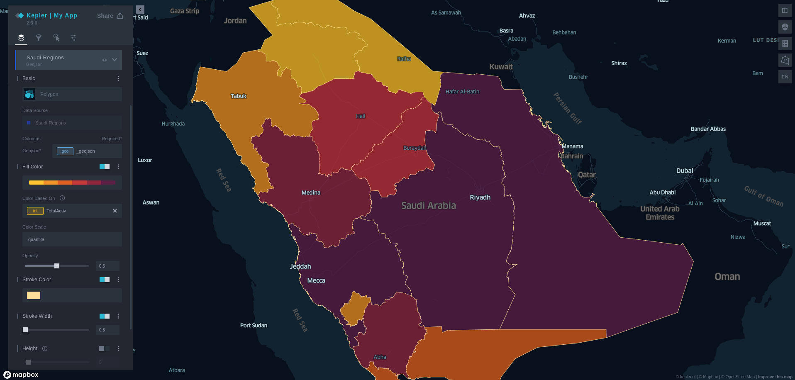
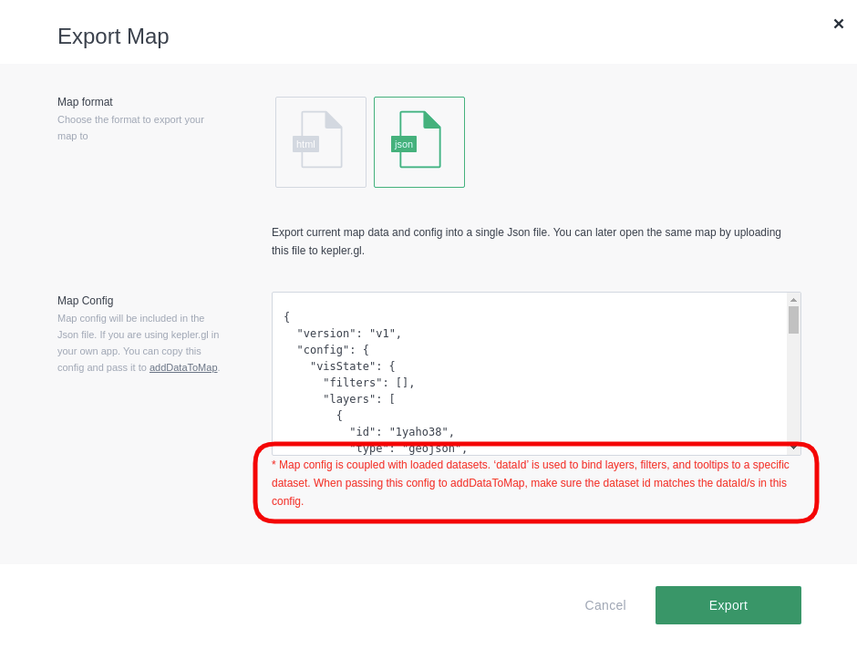

# Building a Map app with Kepler.gl

## :material-chevron-right-circle: Fetch and display data from a remote server on the map

In the previous section, we have loaded a dummy data to the map into kepler's action, `addDataToMap`. Now, we will fetch a real geospatial data from a remote server, [GeoServer](http://geoserver.org/) to be specific, configure it with some styles and filters, and load it to the map.

For this demonstration, we shall use two layers, [COVID-19 Cases In Saudi Arabia Regions](http://datagovsa.mapapps.cloud/layers/geonode_data:geonode:r) and [COVID-19 Cases In Saudi Arabia Governorates](http://datagovsa.mapapps.cloud/layers/geonode_data:geonode:sagov).

!!! tip
    You can explore more layers available at [Saudi Open Data Portal](http://datagovsa.mapapps.cloud/).

!!! note
    All the mentioned code below should be implemented inside `App.js` file alongside the final code in the previous step.

### **1. Fetch remote data**
- In order to fetch remote data, we will use a package called [axios](https://www.npmjs.com/package/axios) which is a promise-based HTTP client taking advantage of async and await for more readable asynchronous code.

- Add the package to the project by running:
```shell
npm i axios
```

- Remove the code-block below by which the dummy data have been loaded before.

```javascript
const sampleTripData = {
        fields: [
            {name: 'tpep_pickup_datetime', format: 'YYYY-M-D H:m:s', type: 'timestamp'},
            {name: 'pickup_longitude', format: '', type: 'real'},
            {name: 'pickup_latitude', format: '', type: 'real'}
        ],
        rows: [
            ['2015-01-15 19:05:39 +00:00', -73.99389648, 40.75011063],
            ['2015-01-15 19:05:39 +00:00', -73.97642517, 40.73981094],
            ['2015-01-15 19:05:40 +00:00', -73.96870422, 40.75424576],
        ]
};

const sampleConfig = {
    visState: {
        filters: [
            {
                id: 'me',
                dataId: 'test_trip_data',
                name: 'tpep_pickup_datetime',
                type: 'timeRange',
                enlarged: true
            }
        ]
    }
}

useEffect(() => {
    dispatch(
        addDataToMap({
            datasets: {
                info: {
                    label: 'Sample Taxi Trips in New York City',
                    id: 'test_trip_data'
                },
                data: sampleTripData
            },
            option: {
                centerMap: true,
                readOnly: false,
                keepExistingConfig: false
            },
            info: {
                title: 'Taro and Blue',
                description: 'This is my map'
            },
            config: sampleConfig
        })
    )
}, [dispatch])
```

- Import the `useState` hook to to add the fetched data to the state object and import `axios` as well.
```javascript
import { useState } from "react"
import axios from "axios"

const Map = () => {
    const [regionsData, setRegionsData] = useState([])
    const [governatesData, setGovernatesData] = useState([])
}
```

- Use the `useEffect` lifecycle hook to perform a GET request using `axios`, we will fetch the two layers (mentioned above) as GeoJSON.

!!! note
    You will need to get the data from an API endpoint as GeoJSON or CSV format. These are the [supported formats](https://docs.kepler.gl/docs/user-guides/b-kepler-gl-workflow/a-add-data-to-the-map#supported-file-formats) by kepler.gl.

- To get the GeoJSON version of the [Regions](http://datagovsa.mapapps.cloud/layers/geonode_data:geonode:r) and [Governorates](http://datagovsa.mapapps.cloud/layers/geonode_data:geonode:sagov) layers, navigate to each one URL, and click on `Download Layer` button, right-click on `GeoJSON` format and copy link address.


```javascript
// Inside Map component
useEffect(() => {
    const requestregions = axios.get("http://datagovsa.mapapps.cloud/geoserver/ows?srsName=EPSG%3A4326&outputFormat=json&service=WFS&srs=EPSG%3A4326&request=GetFeature&typename=geonode%3Ar&version=1.0.0")
    
    const requestGovernates = axios.get("http://datagovsa.mapapps.cloud/geoserver/ows?srsName=EPSG%3A4326&outputFormat=json&service=WFS&srs=EPSG%3A4326&request=GetFeature&typename=geonode%3Asagov&version=1.0.0")

    axios.all([requestregions, requestGovernates])
    .then(axios.spread((...responses) => {
        const regionsData = responses[0].data
        const governatesData = responses[1].data

        setRegionsData(regionsData)
        setGovernatesData(governatesData)
      }
    ))
}, [])
```

- We said before that the data that shall be passed inside `addDataToMap`must be in the format of `fields`and `rows`, but if you check our data by logging the `regionsData` state object to the console, you will find it not in this format. So, we need to figure a way to convert it to the format of `{fields: [], rows: []}`.

- Luckily, kepler.gl got our backs with a processor called `processGeojson` that takes a raw geojson feature collection object as a parameter and outputs a data object with `{fields: [], rows: []}`.

!!! info
    For more information regarding process GeoJSON or CSV data, check the [processors](https://docs.kepler.gl/docs/api-reference/processors/processors) section in kepler's documentation.

- So, all we need to do is to pass the two objects `regionsData` and `governatesData` to the `processGeojson` function and get an object with the format of `{fields: [], rows: []}` as a return.

```javascript hl_lines="1 13 14"
import { processGeojson } from "kepler.gl/processors"

useEffect(() => {
    const requestregions = axios.get("http://datagovsa.mapapps.cloud/geoserver/ows?srsName=EPSG%3A4326&outputFormat=json&service=WFS&srs=EPSG%3A4326&request=GetFeature&typename=geonode%3Ar&version=1.0.0")

    const requestGovernates = axios.get("http://datagovsa.mapapps.cloud/geoserver/ows?srsName=EPSG%3A4326&outputFormat=json&service=WFS&srs=EPSG%3A4326&request=GetFeature&typename=geonode%3Asagov&version=1.0.0")

    axios.all([requestregions, requestGovernates])
    .then(axios.spread((...responses) => {
        const regionsData = responses[0].data
        const governatesData = responses[1].data

        const validRegionsData = processGeojson(regionsData)
        const validGovernatesData = processGeojson(governatesData)

        setRegionsData(validRegionsData)
        setGovernatesData(validGovernatesData)
    }))
}, [])
```

### **2. Add Regions and Governorates data to the map**
- Now our data is ready to be loaded to `addDataToMap` action. Create another `useEffect` to dispatch the action with the data.
```javascript
useEffect(() => {
    if (regionsData && governatesData){
        dispatch(
            addDataToMap({
                datasets: [
                    {
                        info: {
                            label: 'Saudi Regions',
                            id: 'covidRegions'
                        },
                        data: regionsData
                    },
                    {
                        info: {
                            label: 'Saudi Governates',
                            id: 'covidGovernates'
                        },
                        data: governatesData
                    }
                ],
                option: {
                    centerMap: true,
                    readOnly: false
                },
                config: {}
            })
        );
    }
}, [dispatch, regionsData, governatesData])
```

- If you navigate to `http://localhost:3000/`, you should see the data is added to the map succesfully.

!!! info
    You may only see the `Regions` layer appears on the side panel and the map, but not the `Governates`. Don't worry it will be added in the next step.

### **3. Add configurations to the map**
- Navigate to the app UI and interact with the side panel tools, here's an example of customizing the map:
    * Layers tab:
        * Coloring the map based on the intensity value of `TotalActive` column.
        * Adjust the opacity of the layer to `0.5`.
        * Set the Stroke (border of each polygon) Color.

    
    
    * Interactions tab:
        * Set the fields of the data that should appear at the popup identify when you click or hover on the layer.
    
    

    * Base map tab:
        * Set the Map style you want. (e.g. Dark, light, Satellite...)
        * Set the Map layers to show the label, road or land... of each city on top of the layer. 


### **4. Export the configurations file**
- After you finished customizing how the data should appear on the map, click on the `Share` button which is located at the top-right of the side panel, select `Export Map`, use JSON format.



- If you notice, the map configurations file will be coupled with the dataset we have added. If you don't need this behavior to be happened, dispatch the `setExportData` action. This action controls whether to include the loaded data in map config file or not.

```javascript hl_lines="1 30 31"
import { setExportData } from "kepler.gl/actions"

useEffect(() => {
    if (regionsData && governatesData){
        dispatch(
            addDataToMap({
                datasets: [
                    {
                        info: {
                            label: 'Saudi Regions',
                            id: 'covidRegions'
                        },
                        data: regionsData
                    },
                    {
                        info: {
                            label: 'Saudi Governates',
                            id: 'covidGovernates'
                        },
                        data: governatesData
                    }
                ],
                option: {
                    centerMap: true,
                    readOnly: false
                },
                config: {}
            })
        );
        // If map is exported as JSON, export it without the dataset
        dispatch(setExportData(false))
    }
}, [dispatch, regionsData, governatesData])
```

- Repeat the customization you've made in the previous step and try to export the configurations file again. You should get it without the loaded data as expected.

- Save the JSON file in a folder called `data` so that it should be in directory `<app-directory>/src/data/config.json`.

### **5. Add the configurations file to the app**
- The reason why we need to do this step as we need the map each time we load it, to be already styled and configured.

```javascript hl_lines="1 27"
import mapConfig from "./data/config.json";

useEffect(() => {
    if (regionsData && governatesData){
        dispatch(
            addDataToMap({
                datasets: [
                    {
                        info: {
                            label: 'Saudi Regions',
                            id: 'covidRegions'
                        },
                        data: regionsData
                    },
                    {
                        info: {
                            label: 'Saudi Governates',
                            id: 'covidGovernates'
                        },
                        data: governatesData
                    }
                ],
                option: {
                    centerMap: true,
                    readOnly: false
                },
                config: mapConfig
            })
        );
        // If map is exported as JSON, export it without the dataset
        dispatch(setExportData(false))
    }
}, [dispatch, regionsData, governatesData])
```

!!! note
    You can still style and configure how the data appears on the map but keep in mind to export the configurations file to include your customizations and see it when the map loads.

### **6. The final code**
- Compare it with your code if you have errors. Otherwise, Rock and roll to the next section!

```javascript
import React, { useState, useEffect } from 'react';
import { createStore, combineReducers, applyMiddleware } from "redux"
import { taskMiddleware } from "react-palm/tasks"
import { Provider, useDispatch } from "react-redux"
import KeplerGl from "kepler.gl"
import keplerGlReducer from "kepler.gl/reducers"
import { addDataToMap, setExportData } from "kepler.gl/actions"
import { processGeojson } from "kepler.gl/processors"
import axios from "axios"
import mapConfig from "./data/config.json";


const reducers = combineReducers({
    keplerGl: keplerGlReducer
});

const store = createStore(reducers, {}, applyMiddleware(taskMiddleware));

const Map = () => {
    const dispatch = useDispatch();

    const [regionsData, setRegionsData] = useState([])
    const [governatesData, setGovernatesData] = useState([])

    useEffect(() => {
        const requestregions = axios.get("http://datagovsa.mapapps.cloud/geoserver/ows?srsName=EPSG%3A4326&outputFormat=json&service=WFS&srs=EPSG%3A4326&request=GetFeature&typename=geonode%3Ar&version=1.0.0")

        const requestGovernates = axios.get("http://datagovsa.mapapps.cloud/geoserver/ows?srsName=EPSG%3A4326&outputFormat=json&service=WFS&srs=EPSG%3A4326&request=GetFeature&typename=geonode%3Asagov&version=1.0.0")

        axios.all([requestregions, requestGovernates])
        .then(axios.spread((...responses) => {
            const regionsData = responses[0].data
            const governatesData = responses[1].data

            const validRegionsData = processGeojson(regionsData)
            const validGovernatesData = processGeojson(governatesData)

            setRegionsData(validRegionsData)
            setGovernatesData(validGovernatesData)
        }))
    }, [])

    useEffect(() => {
        if (regionsData && governatesData){
            dispatch(
                addDataToMap({
                    datasets: [
                        {
                            info: {
                                label: 'Saudi Regions',
                                id: 'covidRegions'
                            },
                            data: regionsData
                        },
                        {
                            info: {
                                label: 'Saudi Governates',
                                id: 'covidGovernates'
                            },
                            data: governatesData
                        }
                    ],
                    option: {
                        centerMap: true,
                        readOnly: false
                    },
                    config: mapConfig
                })
            )
            dispatch(setExportData(false))
        }
    }, [dispatch, regionsData, governatesData])

    return (
        <KeplerGl
            id="myId"
            mapboxApiAccessToken={process.env.REACT_APP_MAPBOX_API}
            width={window.innerWidth}
            height={window.innerHeight}
            appName="Kepler | My App"
        />
    )
}

function App() {
    return (
        <Provider store={store}>
            <Map />
        </Provider>
    );
}

export default App;
```
